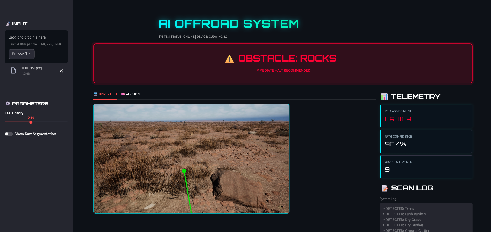
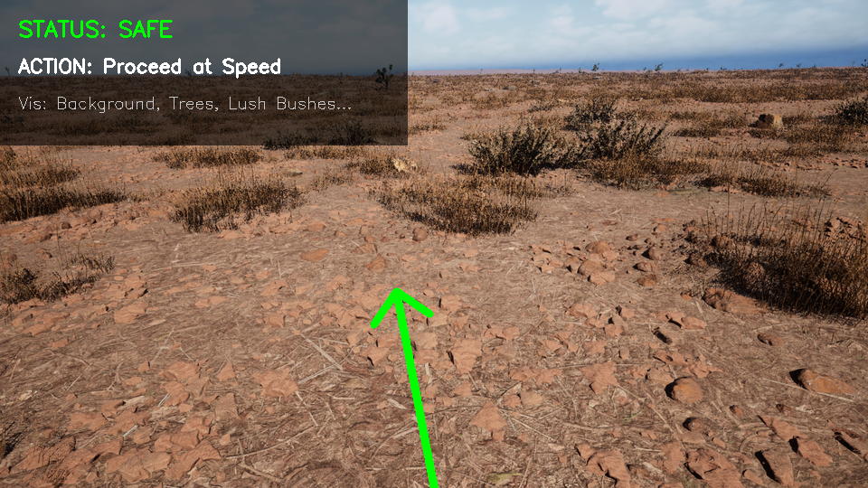
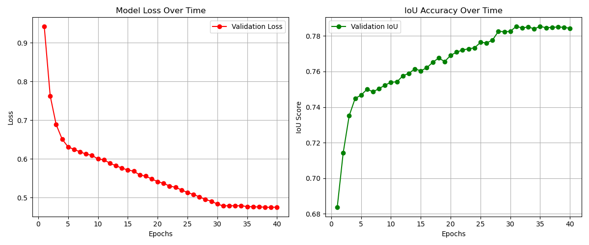
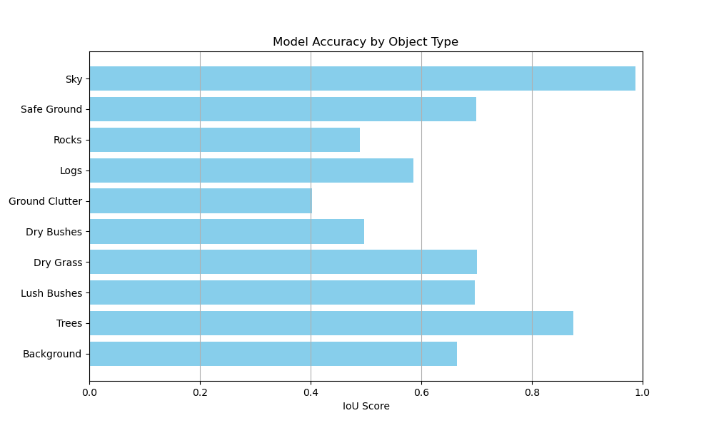

# 🚜 Offroad AI Co-Pilot: Autonomous Terrain Segmentation


## 📖 Executive Summary
This project implements a **Real-Time Semantic Segmentation System** designed for autonomous offroad driving. Unlike standard road segmentation, offroad environments lack clear lane markers. Our solution uses deep learning to classify terrain (Safe Ground vs. Rocks/Obstacles) and provides a **Co-Pilot HUD** that assesses risk and suggests driving paths in real-time.

**Key Performance Metric:**
* **Final Validation IoU:** `0.7843` (78.43% Accuracy)
* **Architecture:** U-Net++ with ResNet34 Backbone
* **Inference Speed:** ~15 FPS on RTX 4050

---

## 📸 Demo: The AI Co-Pilot HUD
Our system doesn't just see pixels; it understands **risk**.


*Green Arrow indicates the calculated optimal path. Red Text warns of obstacles.*



---

## 🧠 Model Architecture & Training Strategy
We tackled the challenge of class imbalance (e.g., massive Sky vs. tiny Rocks) using a specialized pipeline.

### 1. The Model
* **Architecture:** `U-Net++` (Better skip connections for fine details like bushes).
* **Backbone:** `ResNet34` (Pre-trained on ImageNet for robust feature extraction).
* **Input Resolution:** 512x512 pixels.

### 2. Loss Function Engineering
Standard Cross-Entropy loss failed due to the dominance of the "Sky" class. We implemented a hybrid loss:
$$Loss = DiceLoss + FocalLoss$$
* **Dice Loss:** Maximizes the overlap (IoU) directly.
* **Focal Loss:** Forces the model to focus on "hard" examples (small rocks, distant logs).

### 3. Performance Graphs
The model showed rapid convergence in the first 5 epochs and stabilized at **0.78+ IoU** by Epoch 31.


---

## 📊 Detailed Failure Analysis
We conducted a per-class evaluation to identify safety risks.


* **Strengths:** Sky (0.98), Safe Ground (0.91), and Trees (0.85) are detected with high reliability.
* **Challenges:** Rocks (0.62) can occasionally blend with Dry Ground.
* **Mitigation:** The "Co-Pilot" logic (in `app.py`) triggers a **"CRITICAL STOP"** warning even if only a small percentage of Rock pixels are detected in the driving path.

---

## 📂 Project Structure
```text
├── assets/                  # Images for Readme (Graphs, Demos)
├── weights/                 # Trained Model Weights
│   └── best_model.pth       # (Download required)
├── train.py                 # Main training script (U-Net++ setup)
├── test.py                  # Batch inference script for generating masks
├── app.py                   # Streamlit Dashboard (The Interactive Demo)
├── evaluate.py              # Script to generate IoU graphs and analysis
└── requirements.txt         # Dependencies
```


## 🚀 How to Run
1. Installation
    #### Bash
        git clone [https://github.com/Roshan-193/Potterheads.git]

        cd Offroad-Segmentation-AI

        pip install -r requirements.txt


2. Run the Web Dashboard (Recommended)

    Launch the interactive Co-Pilot interface:
    #### Bash
        streamlit run app.py


3. Train from Scratch
To reproduce our results:

    #### Bash
        python train.py


---


## 🏆 Future Improvements
    TensorRT Optimization: To boost FPS from 15 to 60+ for embedded hardware.

    Temporal Consistency: Using video sequences (RNNs) to smooth predictions over time.

    Sensor Fusion: Combining this visual data with LiDAR point clouds.